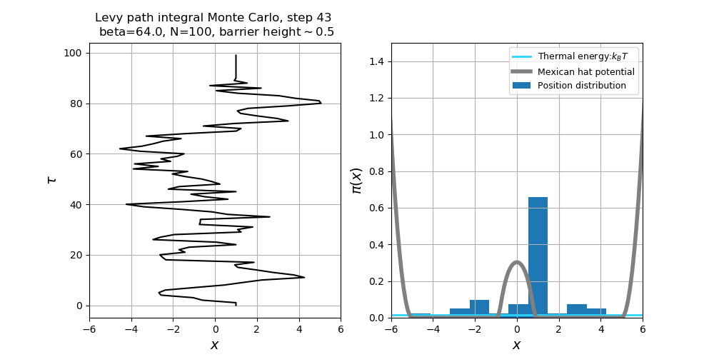

# Simulation in Physics
Illustrating various topics in classical and quantum statistical mechanics through Monte Carlo simulations .

Physical and mathematical subjects that are addressed include:
* Introduction to direct and Markov-chain Monte Carlo sampling
* Equivalence of Newton and Boltzmann mechanics, classical Monte Carlo simulations
* Entropic interactions and a liquid-gas phase transition
* Monte Carlo integration
* Quantum statistical mechanics: path integral representation of the density matrix, quantum Monte Carlo simulations
* Bose-Einstein condensation
* The Ising model of ferromagnetism

The material presented here closely follows "Statistical Mechanics: Algorithms and Computations" by W. Krauth from the École normale supérieure and "Statistical Mechanics: A Set of Lectures" by R. P. Feynman.

  

### Reference:
1. Some resources are obtained from https://github.com/dgoekmen/Statistical-Mechanics with LISENCE retained.
